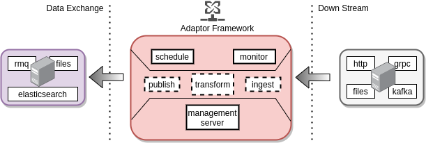
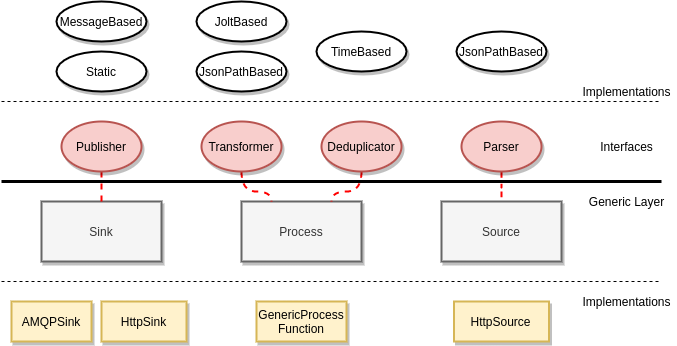

# IUDX Adaptor Framework

A generic and pluggable data ingestion utility based on [Apache Flink](https://github.com/apache/flink).

## Motivation
- Data exchanges are required to produce data in a standard format
- Downstream datasources are diverse in terms of protocol (http, grpc, etc) and data serialization formats (json, xml, protobuf, etc)
- Most of the downstream datasources can be modeled into fixed categories in the context of ingesting and parsing their data
- Maintaining different scripts to ingest data is both inefficient and hard to maintain 
 
 

The above necessitates the need for a tool which:
- Ingests data from diverse sources, protocols and serialization formats
- Ensures data deduplication and late message rejections to give out a stream of novel data
- Transforms the data format into the formats required by the exchange
- Publishes the transformed data into the exchange with flexibility in choosing the sink
- Supporta a fully configuration file based specification and operation of the entire pipeline


## Overview
The figure below shows an overview of the framework. 
Note: Some features are work in progress.


<p align="center">

</p>


## Features
- Based on [Apache Flink](https://github.com/apache/flink)
- Configuration file based specification of the pipeline
- Pluggable for extending capabilities
- [JSON Path](https://github.com/json-path/JsonPath) based parsing and key extraction for watermarking
- [Jolt](https://github.com/bazaarvoice/jolt) based Json-Json transformation
- [Quartz](http://www.quartz-scheduler.org/) based job scheduling
- [Vert x](https://vertx.io/) based Api server with config based pipeline JAR generation, user and adaptor job management and monitoring
- Docker development and deployment


## Implementation
The figure below shows an overview of the implementation of the framework and components involved.
<p align="center">

</p>

The Generic layer is the standard Flink based pipeline which all adaptors are comprised off. The generic layer assumes the implementation of the interfaces which constitute the activity of the particular block. Further, the framework provides standard implementations of the interfaces for specification file based code-generation purposes.
It maybe possible for a developer to pass their own implementation of the interfaces to obtain more control over the components of the pipeline in the Process stage (WIP).


## Usage

Using the framework as an ordinary consumer involves writing a specification file for the entire pipeline (source -> transform -> sink)
and using a hosted instances api to publish the spec and perform the pipeline operations.
There are two fundamental modes of operation - 
1. Bounded mode - The pipeline runs once based on the specified schedule
2. Unbounded mode - The pipeline is always running

### Pipeline Specification file

A pipeline maybe specified in Json format and submitted to the framework server
to auto-generate JAR files and run them. 
The following is the spec outline to be followed in making a configuration file.

#### Spec Outline
``` 
{
    "name": "<unique name for this adaptor",
    "schedulePattern": "<cron like schedule pattern >",

    "failureRecoverySpec": {
    },
    
    "inputSpec": {
    },
    
    "parseSpec": {
    },
    
    "deduplicationSpec": {
    },
    
    "transformSpec": {
    },
    
    "publishSpec": {
    }
}
``` 

Detailed explanation of the individual specs are given below.  
- [Meta spec](docs/meta_spec.md)  
- [Failure Recovery Spec](docs/failurerecovery_spec.md)  
- [Input Spec](docs/input_spec.md)  
- [Parse Spec](docs/parse_spec.md)  
- [Deduplication Spec](docs/parse_spec.md)  
- [Transformation Spec](docs/transform_spec.md)  
- [Publish Spec](docs/publish_spec.md)  

The spec can then be submitted to the adaptor server which will validate it and generate a JAR for the entire pipeline.


### Apis
The framework provides Apis to manage the lifecycle of the adaptor pipeline and to monitor it.
Assuming the administrator of the framework has already provided the user with authentication credentials, 
the Api of relevance to get started with are 

1. **newAdaptor**: Submit the above pipeline spec and create a new adaptor 
   ```
   POST /adaptor
   Header: {"username": "uname", "password": "password"}
   Body: Spec File
   Content-Type: application/json
   Response: 202 (Accepted and generating jar), 401 (Unauthorized), 400 (Bad spec file) 
   ```

2. **getAdaptors**: List all the adaptors and their running state (including recently submitted ones) and their ids
   ```
   GET /adaptor
   Header: {"username": "uname", "password": "password"}
   Content-Type: application/json
   Response: 200 (List of adaptors and their running state)
   ``` 
  
3. **startAdaptor**: Start and adaptor given its id. Starts even scheduled adaptors. 
   ```
   POST /adaptor/{id}/start
   Header: {"username": "uname", "password": "password"}
   Content-Type: application/json
   Response: 200 (Success), 404 (No such adaptor), 401 (Unauthorized)
   ```

4. **stopAdaptor**: Stop and adaptor given its id. Stops even scheduled adaptors. 
   ```
   POST /adaptor/{id}/stop
   Header: {"username": "uname", "password": "password"}
   Content-Type: application/json
   Response: 200 (Success), 404 (No such adaptor), 401 (Unauthorized)
   ```
   

5. **deleteAdaptors**: Delete an adaptor given its id
   ```
   DELETE /adaptor/{id}
   Header: {"username": "uname", "password": "password"}
   Content-Type: application/json
   Response: 200 (Deleted), 404 (No such adaptor), 401 (Unauthorized)
   ```

On submitting the adaptor pipeline spec file, the server will generate a JAR with all the dependencies and run the pipeline according to the configurations specified.

The entire API specification can be found [here](./docs/openapi.yml).


## Starting a local development/deployment environment
1. Build all required images 
   `./setup/build.sh`
3. Modify `./configs/config-example.json` and make the server config. 
   Modify `./configs/quartz.properties` and make the quartz config.
4. Modify `./setup/*/docker-compose` to take up the correct config files.
5. Bring up the local environment 
   `./setup/start_local_dev_env.sh` 
   This brings up flink, rabbitmq, the apiserver and a mockserver.
6. Use the apis to submit the above example config


## Future Works
1. Spec validation
2. Local playground for local spec testing
3. Support for diverse sources (AMQP, MQTT, GRPC) and sinks (Elasticsearch, Redis, Kafka)
