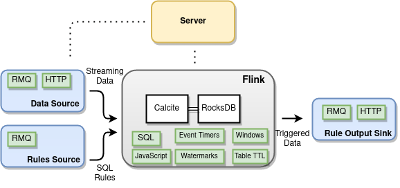

# IUDX Adaptor Framework

A generic and pluggable data ingress/egress utility supporting ETL and Rules Engine operations 
based on [Apache Flink](https://github.com/apache/flink).

- Ingests data from diverse sources, protocols and serialization formats
- Supports data-deduplication, watermarking, event timers and windowing
- Pluggable sources and sinks for different modes of operations
- Scriptable (JS) data transformations
- Streaming SQL support for Rules Engine like applications
- Supports a configuration file based specification and operation of the entire pipeline


## Overview
The figure below shows an overview of the framework. 

<p align="center">

</p>


## Features
- Based on [Apache Flink](https://github.com/apache/flink)
- Configuration file based specification of the pipeline
- Pluggable for extending capabilities
- [Calcite](https://calcite.apache.org/) based SQL engine acting as a rules engine
- [RocksDB](http://rocksdb.org/) based streaming data storage for SQL queries
- [Nashorn](https://github.com/openjdk/nashorn) based JS Scripting for data transformation
- [JSON Path](https://github.com/json-path/JsonPath) based key-value access
- [Jolt](https://github.com/bazaarvoice/jolt) based Json-Json transformation
- [Quartz](http://www.quartz-scheduler.org/) based job scheduling
- [Vert x](https://vertx.io/) based Api server with config based pipeline JAR generation, user and adaptor job management and monitoring
- Docker development and deployment


## Rules Engine
In addition to stream ETL, the framework can also be used in a rules engine mode.
We allow users to pass dynamic runtime SQL queries whcih can be run on buffered streaming data.
<p align="center">

</p>


## Usage

Framework can be used in 2 applications

1. [ETL Pipeline](docs/etl_usage.md) - Framework can be used in ETL (extract, transform, 
   load) pipeline. Consumer can write a specification file for the entire pipeline (source -> 
   transform -> sink) and use hosted instances api to publish the spec and perform the pipeline 
   operations.
2. [Rules Engine](docs/rules_usage.md) - Framework can also be used for executing rules 
   on streaming data. Consumer can submit the rule using API and receive alerts. 

### Apis
The framework provides Apis to manage the lifecycle of the adaptor pipeline and to monitor it.
Assuming the administrator of the framework has already provided the user with authentication credentials, 
the Api of relevance to get started with are 

1. **newAdaptor**: Submit the above pipeline spec and create a new adaptor. This can be ETL or RULE based.
   ```
   POST /adaptor
   Header: {"username": "uname", "password": "password"}
   Body: Spec File
   Content-Type: application/json
   Response: 202 (Accepted and generating jar), 401 (Unauthorized), 400 (Bad spec file) 
   ```

2. **getAdaptors**: List all the adaptors and their running state (including recently submitted ones) and their ids
   ```
   GET /adaptor
   Header: {"username": "uname", "password": "password"}
   Content-Type: application/json
   Response: 200 (List of adaptors and their running state)
   ``` 
  
3. **startAdaptor**: Start and adaptor given its id. Starts even scheduled adaptors. 
   ```
   POST /adaptor/{id}/start
   Header: {"username": "uname", "password": "password"}
   Content-Type: application/json
   Response: 200 (Success), 404 (No such adaptor), 401 (Unauthorized)
   ```

4. **stopAdaptor**: Stop and adaptor given its id. Stops even scheduled adaptors. 
   ```
   POST /adaptor/{id}/stop
   Header: {"username": "uname", "password": "password"}
   Content-Type: application/json
   Response: 200 (Success), 404 (No such adaptor), 401 (Unauthorized)
   ```
   

5. **deleteAdaptors**: Delete an adaptor given its id
   ```
   DELETE /adaptor/{id}
   Header: {"username": "uname", "password": "password"}
   Content-Type: application/json
   Response: 200 (Deleted), 404 (No such adaptor), 401 (Unauthorized)
   ```

6. **newRule**: Create a new SQL rule for an already running RULE adaptor
   ```
   POST /rule
   Header: {"username": "uname", "password": "password"}
   Body: Rule object
   Content-Type: application/json
   Response: 200 (Deleted), 404 (No such adaptor), 401 (Unauthorized)
   ```
   [Rule object body](./docs/rule_format.md)

On submitting the adaptor pipeline spec file, the server will generate a JAR with all the dependencies and run the pipeline according to the configurations specified.

The entire API specification can be found [here](./docs/openapi.yml).


## Starting a local development/deployment environment
1. Build all required images 
   `./setup/build.sh`
3. Modify `./configs/config-example.json` and make the server config. 
   Modify `./configs/quartz.properties` and make the quartz config.
4. Modify `./setup/*/docker-compose` to take up the correct config files.
5. Bring up the local environment 
   `./setup/start_local_dev_env.sh` 
   This brings up flink, rabbitmq, the apiserver and a mockserver.
6. Use the apis to submit the above example config
