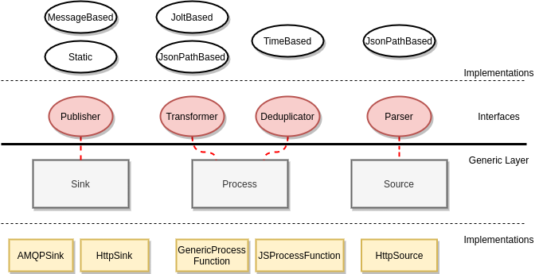

# IUDX Adaptor Framework

A generic and pluggable data ingestion utility based on [Apache Flink](https://github.com/apache/flink).

## Motivation
- Data exchanges are required to produce data in a standard format
- Downstream datasources are diverse in terms of protocol (http, grpc, etc) and data serialization formats (json, xml, protobuf, etc)
- Most of the downstream datasources can be modeled into fixed categories in the context of ingesting and parsing their data
- Maintaining different scripts to ingest data is both inefficient and hard to maintain 
 
 

The above necessitates the need for a tool which:
- Ingests data from diverse sources, protocols and serialization formats
- Ensures data deduplication and late message rejections to give out a stream of novel data
- Transforms the data format into the formats required by the exchange
- Publishes the transformed data into the exchange with flexibility in choosing the sink


## Overview
The figure below shows an overview of the framework. 
Note: Some features are work in progress.


<p align="center">

</p>


## Features
- Based on [Apache Flink](https://github.com/apache/flink)
- Configuration file based specification of the pipeline
- Pluggable for extending capabilities
- [JSON Path](https://github.com/json-path/JsonPath) based parsing and key extraction for watermarking
- [Jolt](https://github.com/bazaarvoice/jolt) based Json-Json transformation
- [Quartz](http://www.quartz-scheduler.org/) based job scheduling
- [Vert x](https://vertx.io/) based Api server with user and adaptor job management and monitoring
- Docker development and deployment


## Implementation
The figure below shows an overview of the implementation of the framework and components involved.
<p align="center">

</p>

The Generic layer is the standard Flink based pipeline which all adaptors are comprised off. The generic layer assumes the implementation of the interfaces which constitute the activity of the particular block. Further, the framework provides standard implementations of the interfaces for specification file based code-generation purposes.
It maybe possible for a developer to pass their own implementation of the interfaces to obtain more control over the components of the pipeline.


## Pipeline Specification File

A pipeline maybe specified in Json format and submitted to the framework server
to auto-generate JAR files and run them. 
The following is the spec outline to be followed in making a configuration file.

### Spec Outline
``` 
{
    "name": "<unique name for this adaptor",
    
    "inputSpec": {
    },
    
    // Below specs apply specifically for the inputSpec type
    
    "parseSpec": {
    },
    
    "deduplicationSpec": {
    },
    
    "transformSpec": {
    },
    
    "publishSpec": {
    }
}
``` 


### Input spec

``` 

{
    "type": "<http|protobuf>",
    "url": "<url with protocol>",
    "requestType": "<GET | POST",
    "pollingInterval": <number (if > threshold, will be batch job)>,
    "headers": {
        ... <map> ...
    },
    "postBody": "<templated body, later support for changing body params will be supported>"
}
```


### Parse Spec for json
Currently only for json
``` 
{
    "type": "<json|xml>",
    "messageContainer": "<array - multiple messages in same message |
                          single - single message in one message>"
    "containerPath": "json path to container (list of objects) of messages in case
                        inputSpec.messageContainer == array.
                      Subsequent to this all paths will apply to individual objects
                      of the container."
    "timestampPath": "json path to time",
    "keyPath": "json path to key (deviceId/id etc)",
    
}
```


### Deduplication spec
``` 
{
    "type": "<timeBased | extraKeyBased >"
}
```


### Transform spec
Currently only for json
``` 
{
    "type": "<jolt | jsonPath>",
    "joltSpec": "<stringified jolt spec>",
    "jsonPathSpec": "<stringified json path spec>"
}
```


### Publish spec
Currently on for RMQ
``` 
{
    "type": "<rmq>"
    "url": "<url with protocol no port>",
    "port": <port>,
    "uname": "<uname>",
    "password": "<password>",
    "sinkName": "<exchange name>",
    "tagName": "<routing key>"
}
```

Once the pipeline is specified according to the above, it maybe submitted 
to the adaptor server (which maybe locally brought up as shown in [Getting started](Getting started).


## Starting a local development/deployment environment
1. Build the server and mockserver (for development) docker images 
   `./setup/server/setup_server.sh` 
   `./setup/mockserver/setup_mockserver.sh`  
2. Modify `./configs/config-example.json` and make the server config. 
   Modify `./configs/quartz.properties` and make the quartz config.
3. Modify `./setup/*/docker-compose` to take up the correct config files.
4. Bring up the local environment 
   `./setup/start_local_dev_env.sh`
5. Use the apis to submit a config
   


## Future Works
1. JsonPath based transformer
2. JavaScript based transformer
3. Auto generation of logging streams and dashboards
4. Multi-input sources
