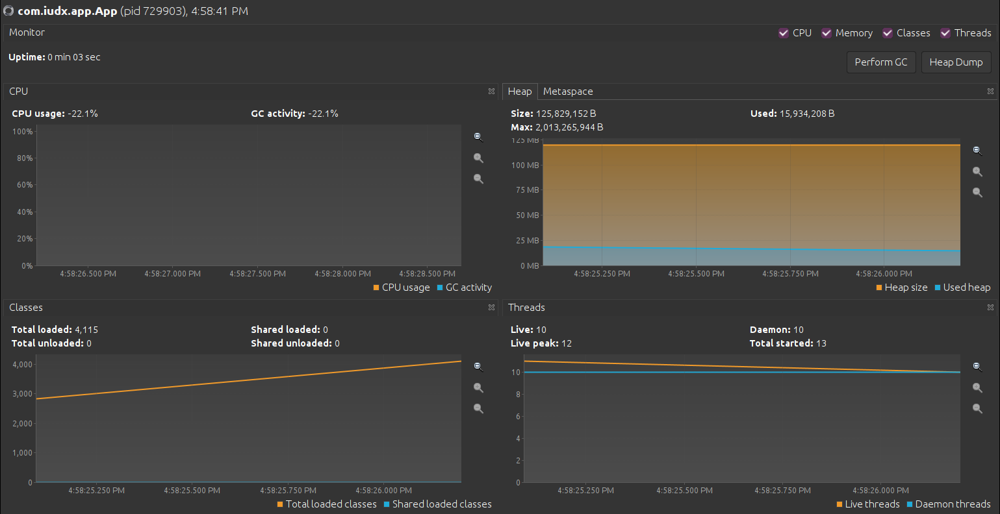
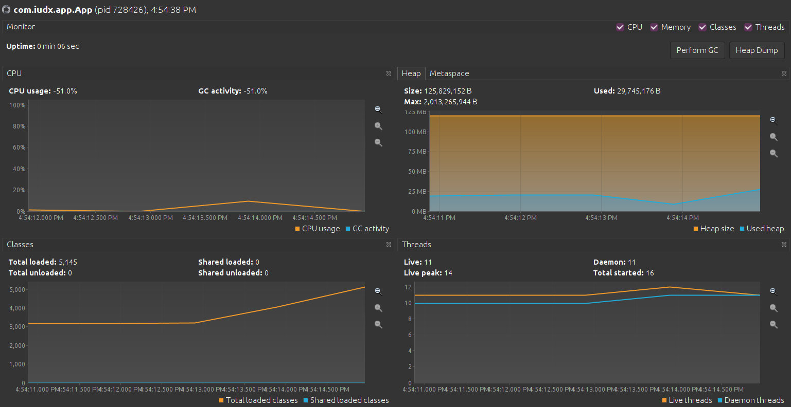

# Benchmarking

Commands to run

### Java based JS Engine test

```
mvn package
mvn exec:exec
```

### Python Test

```
python3 test.py
```

### Javascript Test

```
node index.js
```

## Test Result

All of the following are running same prime number generator code

| Engine  | Total Time |
| ------- | ---------- |
| Rhino   | 1835 ms    |
| Nashorn | 662 ms     |
| GraalVM | 2154 ms    |

Same code run in plain language scope

| Language | Total Time |
| -------- | ---------- |
| Java     | 54 ms      |
| Python   | 4 seconds  |
| NodeJS   | 46 ms      |

## Script execution CDN vs Local

Following result is based on running days javascript library in local and CDN scripts with nashron engine

| Script Type | Total Time |
| ----------- | ---------- |
| Local       | 900 ms     |
| CDN Script  | 2200 ms    |

Profiling result as follows

- Local
  


- CDN
  


### RabbiMQ Latency Test


```
python3 rmq_latency.py <job-name/routing-key>
```

Replace appropriate routing key

Note: If any error related to date time update the format according to the received timestamp, default - "%Y-%m-%dT%H:%M:%S.%fZ"


| Parsing Type   | Interval | Latency  |
| -------------- | -------- | -------- |
| Jolt Config    | 100ms    | 10-11 ms |
| Jolt Config    | 500ms    | 10-11 ms |
| Jolt Config    | 1000ms   | 10-11 ms |
| JS Config      | 100ms    | 10-11 ms |
| JS Config      | 500ms    | 10-11 ms |
| JS Config      | 1000ms   | 10-11 ms |
| JS Path Config | 100ms    | 10-11 ms |
| JS Path Config | 500ms    | 10-11 ms |
| JS Path Config | 1000ms   | 10-11 ms |


All the above result are run on following machine

- CPU: 11th Gen Intel(R) Core(TM) i5-1135G7 @ 2.40GHz 4 core
- RAM: 8GB